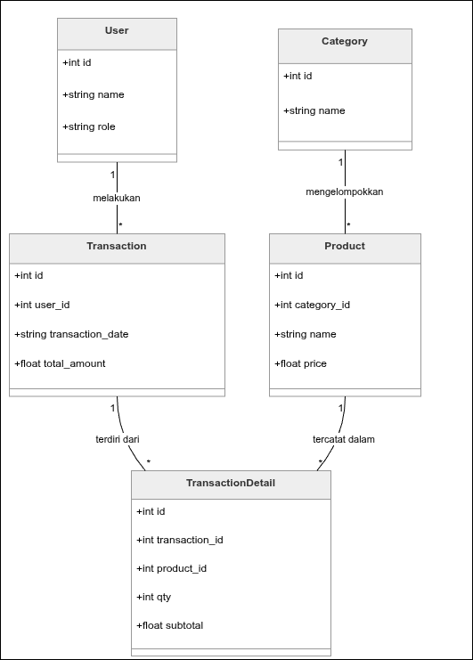
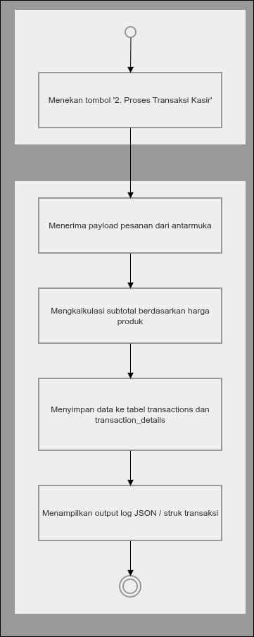

<style>
  /* Base Theme & Typography */
  section {
    background-color: #1e1e2e;
    color: #cdd6f4;
    font-family: 'Inter', system-ui, -apple-system, sans-serif;
    font-size: 26px;
  }
  
  /* Headings */
  h1, h2, h3 {
    color: #89b4fa;
    border-bottom: 2px solid #313244;
    padding-bottom: 5px;
    margin-bottom: 20px;
  }
  
  /* Links */
  a {
    color: #89dceb;
    text-decoration: none;
    transition: all 0.2s ease-in-out;
  }
  a:hover {
    filter: brightness(1.2);
    text-shadow: 0 0 5px rgba(137, 220, 235, 0.4);
  }
  
  /* Strong Text */
  strong {
    color: #f9e2af;
  }
  
  /* Outline / Inline Code */
  p > code, li > code {
    background-color: #313244;
    color: #f38ba8;
    padding: 2px 6px;
    border-radius: 4px;
    font-family: 'Fira Code', monospace;
  }
  
  /* Preformatted Code Blocks */
  pre {
    background-color: #181825;
    border: 1px solid #45475a;
    border-radius: 8px;
    box-shadow: 0 4px 6px rgba(0, 0, 0, 0.5);
  }
  pre code {
    color: #e0e0e0;
    background-color: transparent;
    padding: 0;
  }
  
  /* Syntax Highlighting (Neon Colors untuk TypeScript) */
  .hljs-keyword, .hljs-literal { color: #ff007f !important; font-weight: bold !important; text-shadow: 0 0 2px rgba(255,0,127,0.4); } /* Neon Pink */
  .hljs-string { color: #39ff14 !important; text-shadow: 0 0 2px rgba(57,255,20,0.4); } /* Neon Green */
  .hljs-built_in, .hljs-type { color: #00ffff !important; text-shadow: 0 0 2px rgba(0,255,255,0.4); } /* Neon Cyan */
  .hljs-title.function_, .hljs-title.class_ { color: #bc13fe !important; font-weight: bold !important; text-shadow: 0 0 2px rgba(188,19,254,0.4); } /* Neon Purple */
  .hljs-number { color: #fce205 !important; text-shadow: 0 0 2px rgba(252,226,5,0.4); } /* Neon Yellow */
  .hljs-params, .hljs-property { color: #f8f8f2 !important; }
  .hljs-comment { color: #8a8a8a !important; font-style: italic !important; }

  /* Slide Pagination Numbering */
  section::after {
    content: attr(data-marpit-pagination) !important;
    position: absolute !important;
    right: 40px !important;
    bottom: 30px !important;
    color: #888888 !important; /* Warna abu-abu */
    font-weight: bold !important;
    font-size: 24px !important;
    text-shadow: none !important;
    z-index: 999 !important;
  }
  
  /* Background styles for transparent IMGs in dark mode */
  .img-bg-fix {
    background-color: #e5e9f0;
    padding: 15px;
    border-radius: 12px;
    box-shadow: 0 4px 10px rgba(0,0,0,0.5);
  }
  
  /* Flexbox Layouts for Image & Text side by side */
  .layout-flex {
    display: flex;
    justify-content: space-between;
    align-items: flex-start;
    gap: 30px;
  }
  .layout-flex > div {
    flex: 1;
  }
</style>

# Analisis & Reverse Engineering Sistem Informasi Kasir (POS)

**Mata Kuliah:** Rekayasa Perangkat Lunak (RPL)
**Jenis Tugas:** Ujian Akhir Semester (UAS)

**Anggota Kelompok:**
1. Bayu
2. Muhammad Akbar
3. Fitria Rofiqoh

---
**Studi Kasus:** Audit logika bisnis dan rekonstruksi arsitektur backend pada sistem kasir berbasis Node.js + Express.

**Tujuan:** Memetakan alur backend, struktur data, dan menemukan celah keamanan serta rekomendasi perbaikan teknis.

---
# Ringkasan Proyek & Metodologi

**Metode Pengecekan:**
- Membongkar dan menganalisis kode sumber aplikasi (*Reverse Engineering*).
- Cek alur Node.js / Express (rute API, pengolah data, dan model).
- Tes kode secara langsung dan simulasi transaksi di lingkungan uji coba.

**Tujuan & Fokus Utama:**
- Audit alur kerja sistem, menyusun ulang struktur *database*, dan mencari celah keamanan.
- Memastikan interaksi pengguna, aturan relasi antar data (minimal 5 tabel), dan keutuhan struk transaksi berjalan dengan benar.
---
<br>

**Bukti Pengecekan: Titik Awal Aplikasi (File: src/index.ts)**
```typescript
import express from 'express';
import db from './db/sqlite.js';

const app = express();

app.use(express.json()); 

const PORT = process.env.PORT || 3000;
app.listen(PORT, () => {
  console.log(`Server kasir berjalan lancar di http://localhost:${PORT}`);
});
```
---
<!-- Slide 3 (Hub) -->
# **Pemetaan Interaksi: Actor & Use Cases**

<div class="layout-flex">
<div>

**Aktor Utama:** Kasir (Staff Operasional)
*Silakan klik pada salah satu proses di diagram untuk melihat detail bukti audit E2E, atau klik tombol di bawah untuk lanjut.*

<br><br>

  <!-- Tombol Skip ke Materi Selanjutnya (Arahkan ke Slide 7) -->
  <a href="#9" style="display: inline-block; padding: 12px 24px; background-color: #f9e2af; color: #1e1e2e; text-decoration: none; border-radius: 6px; font-weight: bold; font-size: 0.9em; box-shadow: 0 4px 6px rgba(0,0,0,0.3);">⏭️ Lewati Detail, Lanjut ke Struktur Database</a>

</div>

<div class="img-bg-fix" style="text-align: center; position: relative; display: inline-block; width: 100%; max-width: 550px;">
  <!-- Gambar Diagram Utama -->
  
  <!-- Area Klik 1: Seeder (Arahkan ke Slide 4) -->
  <a href="#6" style="position: absolute; top: 16%; left: 29%; width: 50%; height: 16%;" title="Bedah Fitur Seeder"></a>
  <!-- Area Klik 2: Transaksi (Arahkan ke Slide 5) -->
  <a href="#7" style="position: absolute; top: 44%; left: 29%; width: 50%; height: 12%;" title="Bedah Fitur Transaksi"></a>
  <!-- Area Klik 3: Laporan (Arahkan ke Slide 6) -->
  <a href="#8" style="position: absolute; top: 68%; left: 29%; width: 50%; height: 12%;" title="Bedah Fitur Laporan"></a>
</div>
</div>

---
<!-- Slide 4 (Detail 1) -->
# Detail Audit: 1. Menjalankan Seeder
<a href="#5" style="display: inline-block; padding: 5px 15px; background-color: #89b4fa; color: #11111b; font-weight: bold; box-shadow: 0 4px 6px rgba(0,0,0,0.3); text-decoration: none; border-radius: 5px; margin-bottom: 15px;">🔙 Kembali ke Diagram Use Case</a>

**Sisi Antarmuka (Aksi di Browser)**
```html
<button onclick="runSeed()">1. Jalankan Seeder (Isi Data Dummy)</button>
<script>
  function runSeed() { fetchAPI('/api/seed', 'POST'); }
</script>
```
**Sisi Server (Eksekusi API di Node.js)**
```typescript
app.post('/api/seed', asyncHandler(async (req: Request, res: Response) => {
  await dbRun(`INSERT INTO users (name, role) VALUES (?, ?)`, ['Kasir Satu', 'Cashier']);
  await dbRun(`INSERT INTO categories (name) VALUES (?)`, ['Elektronik']);
  await dbRun(`INSERT INTO products ... VALUES (?, ?, ?)`, [1, 'Kabel Data', 25000]);
  
  res.status(201).json({ message: 'Data dummy berhasil di-generate!' });
}));
```
---
# Detail Audit: 2. Memproses Transaksi Kasir
<a href="#5" style="display: inline-block; padding: 5px 15px; background-color: #89b4fa; color: #11111b; font-weight: bold; box-shadow: 0 4px 6px rgba(0,0,0,0.3); text-decoration: none; border-radius: 5px; margin-bottom: 15px;">🔙 Kembali ke Diagram Use Case</a>
**Sisi Antarmuka (Aksi di Browser)**
```typescript
function runTx() { 
  fetchAPI('/api/transactions', 'POST', { 
    user_id: 1, 
    items: [ { product_id: 1, qty: 2 }, { product_id: 2, qty: 1 } ] 
  }); 
}
```
**Sisi Server (Penerimaan & Validasi di Node.js)**
```typescript
app.post('/api/transactions', asyncHandler(async (req: Request, res: Response) => {
  const { user_id, items } = req.body as { user_id: number; items: any[] };

  if (!user_id || !items || items.length === 0) {
    throw new AppError('Data transaksi tidak lengkap.', 400);
  }
  ```
  ---
# Detail Audit: 3. Melihat Laporan Penjualan
<a href="#5" style="display: inline-block; padding: 5px 15px; background-color: #89b4fa; color: #11111b; font-weight: bold; box-shadow: 0 4px 6px rgba(0,0,0,0.3); text-decoration: none; border-radius: 5px; margin-bottom: 15px;">🔙 Kembali ke Diagram Use Case</a>
**Sisi Antarmuka (Aksi di Browser)**
```typescript
function runReport() { 
  fetchAPI('/api/reports/sales', 'GET'); 
}
```
**Sisi Server (Perakitan Laporan di Node.js)**
```typescript
app.get('/api/reports/sales', asyncHandler(async (req: Request, res: Response) => {
  const query = `
    SELECT t.transaction_date, u.name AS cashier_name, p.name AS product_name...
    FROM transactions t JOIN users u ON t.user_id = u.id ...
  `;
  const reports = await dbAll(query);
  res.status(200).json({ data: reports });
}));
```
---
# Struktur Data

<div class="layout-flex">
  <div style="padding-right: 20px;">
    <p><strong>Desain Relasional (Entity-Relationship Diagram):</strong></p>
    <p>Sistem dirancang dengan normalisasi mendekati 3NF untuk menjaga konsistensi harga historis pada tabel transaksi.</p>
    
  <ul>
      <li><strong>Entitas Master:</strong> <code>users</code>, <code>categories</code>, <code>products</code>.</li>
      <li><strong>Entitas Transaksional:</strong> <code>transactions</code> (Header) dan <code>transaction_details</code> (Line Items).</li>
      <li><strong>Integritas Data:</strong> Dilindungi secara ketat oleh <em>Foreign Key</em>.</li>
    </ul>
  </div>
  
  <div class="img-bg-fix" style="display: flex; justify-content: center; align-items: center;">
    
  </div>
</div>

---
# Struktur Aplikasi: Class Diagram OOP

<div class="layout-flex">
  <div style="padding-right: 20px;">
    <p><strong>Desain Layer Aplikasi:</strong></p>
    <p>Selain ERD di layer <em>database</em>, sistem juga dimodelkan secara <em>Object-Oriented</em> di layer aplikasi untuk standarisasi pertukaran data.</p>
    
  <ul>
      <li><strong>5 Interface Utama:</strong> <code>User</code>, <code>Category</code>, <code>Product</code>, <code>Transaction</code>, <code>TransactionDetail</code>.</li>
      <li><strong>Tipe Data Ketat:</strong> Validasi <em>Role</em> dan <em>Number/String</em> diterapkan sejak awal.</li>
    </ul>

  <br> 
  <br><br>
  </div>
  
  <div class="img-bg-fix" style="display: flex; justify-content: center; align-items: center;">
    
  </div>
</div>

<!-- Slide 15 (Logika Alur Kerja - Activity Diagram) -->
---
# Logika Alur Kerja Transaksi: Activity Diagram

<div class="layout-flex">
  <div style="padding-right: 20px;">
    
<ul>
    <li><strong>1. Inisiasi:</strong> Aktor menekan tombol proses transaksi.</li>
      <li><strong>2. Penerimaan:</strong> Sistem menerima *payload* pesanan dari antarmuka.</li>
      <li><strong>3. Kalkulasi:</strong> Mengkalkulasi subtotal berdasarkan harga produk (Validasi Anti-Fraud).</li>
      <li><strong>4. Penyimpanan:</strong> Menyimpan data secara atomik ke tabel <code>transactions</code> dan <code>transaction_details</code>.</li>
      <li><strong>5. Output:</strong> Menampilkan *log* <strong>JSON</strong> atau struk transaksi ke layar kasir.</li>
    </ul>

<br><br>
    <!-- Tombol Lanjut ke Sequence Diagram (Slide 16) -->
    <a href="#12" style="display: inline-block; padding: 12px 24px; background-color: #f9e2af; color: #1e1e2e; text-decoration: none; border-radius: 6px; font-weight: bold; font-size: 0.9em; box-shadow: 0 4px 6px rgba(0,0,0,0.3);">⏭️ Bedah Kode di Sequence Diagram</a>
  </div>
  <div class="img-bg-fix" style="display: flex; justify-content: center; align-items: center;">
    <!-- Gambar Activity Diagram -->
    
  </div>
</div>

---
# Alur Kerja Transaksi: Sequence Diagram
<div style="display: flex; justify-content: center; width: 100%; margin-top: 10px;">
  
  <div class="img-panel-db" style="position: relative; display: inline-block;">
    
    
<a href="#13" style="position: absolute; top: 8%; left: 10%; width: 80%; height: 13%; " title="Bedah Fase 1: Request"></a>
    
<a href="#14" style="position: absolute; top: 23%; left: 40%; width: 50%; height: 22%;" title="Bedah Fase 2: Validasi Harga"></a>
    
<a href="#15" style="position: absolute; top: 48%; left: 40%; width: 50%; height: 10%;" title="Bedah Fase 3: Insert Header"></a>

<a href="#16" style="position: absolute; top: 60%; left: 40%; width: 50%; height: 18%; " title="Bedah Fase 4: Insert Details"></a>

<a href="#17" style="position: absolute; top: 80%; left: 10%; width: 80%; height: 12%;" title="Bedah Fase 5: Response"></a>
</div>
</div>

<div style="text-align: center; margin-top: 25px;">
  <a href="#18" style="display: inline-block; padding: 12px 24px; background-color: #f9e2af; color: #1e1e2e; text-decoration: none; border-radius: 6px; font-weight: bold; font-size: 0.9em; box-shadow: 0 4px 6px rgba(0,0,0,0.3);">⏭️ Lanjut ke Temuan Kritis Audit</a>
</div>

---
# Detail Sequence: 1. Penerimaan Payload
<a href="#12" style="display: inline-block; padding: 5px 15px; background-color: #89b4fa; color: #1e1e2e; text-decoration: none; border-radius: 5px; font-weight: bold; margin-bottom: 15px;">🔙 Kembali ke Sequence Diagram</a>

**Fokus:** **Aktor** mengirim data belanjaan, lalu **Express** memvalidasi keberadaan `user_id` dan `items`.

```typescript
// Lifeline Antarmuka (Klien) mengirim pesan
fetchAPI('/api/transactions', 'POST', { user_id: 1, items: [...] });

// Lifeline API Server (Backend) menerima pesan
app.post('/api/transactions', asyncHandler(async (req: Request, res: Response) => { 
  const { user_id, items } = req.body;
}));
```
---
# Detail Sequence: 2. Validasi Harga
<a href="#12" style="display: inline-block; padding: 5px 15px; background-color: #89b4fa; color: #1e1e2e; text-decoration: none; border-radius: 5px; font-weight: bold; margin-bottom: 15px;">🔙 Kembali ke Sequence Diagram</a>

**Fokus:** **Looping** untuk mengecek harga asli di `database` guna mencegah manipulasi payload dari sisi klien.
```typescript
for (const item of items) {
  // Panah Solid: API meminta data ke Database
  const products = await dbAll(
    `SELECT price FROM products WHERE id = ?`, [item.product_id]
  );

  // Panah Putus-putus: Database mengembalikan data ke API
  const price = products[0].price;
}
```
---
# Detail Sequence: 3. Insert Header Transaksi
<a href="#12" style="display: inline-block; padding: 5px 15px; background-color: #89b4fa; color: #1e1e2e; text-decoration: none; border-radius: 5px; font-weight: bold; margin-bottom: 15px;">🔙 Kembali ke Sequence Diagram</a>

**Fokus:** Pembuatan record nota utama di tabel `transactions`.
```typescript
// Panah Solid: API mengirim perintah Insert
const insertTx = await dbRun(
  `INSERT INTO transactions (user_id, transaction_date, total_amount) VALUES (?, ?, ?)`,
  [user_id, dateNow, total_amount]
);

// Panah Putus-putus: API menangkap ID yang dikembalikan Database
const transaction_id = insertTx.id;
```
---
# Detail Sequence: 4. Insert Detail Item
<a href="#12" style="display: inline-block; padding: 5px 15px; background-color: #89b4fa; color: #1e1e2e; text-decoration: none; border-radius: 5px; font-weight: bold; margin-bottom: 15px;">🔙 Kembali ke Sequence Diagram</a>

**Fokus:** **Looping** untuk menyimpan setiap barang yang dibeli ke tabel `transaction_details`
```typescript
for (const detail of processedItems) {
  // Panah Solid: API mengirim perintah Insert Detail
  await dbRun(
    `INSERT INTO transaction_details (transaction_id, product_id, qty, subtotal) VALUES (?, ?, ?, ?)`,
    [transaction_id, detail.product_id, detail.qty, detail.subtotal]
  );
  // Panah Putus-putus (Success) terjadi secara implisit jika tidak ada error
}
```
---
# Detail Sequence: 5. Response ke Klien
<a href="#12" style="display: inline-block; padding: 5px 15px; background-color: #89b4fa; color: #1e1e2e; text-decoration: none; border-radius: 5px; font-weight: bold; margin-bottom: 15px;">🔙 Kembali ke Sequence Diagram</a>

**Fokus:** Pengembalian status kode **201 Created** beserta metadata struktur JSON sebagai bukti transaksi berhasil.
```typescript
// Panah Putus-putus panjang: API Server membalas ke Antarmuka
res.status(201).json({
  message: 'Transaksi berhasil diproses.',
  data: { transaction_id, total_amount, date: dateNow }
});
```
---
# Temuan Kritis: Hasil Audit & Reverse Engineering

Berdasarkan penelusuran *source code* dan pengujian E2E, kami menemukan **3 celah kritikal** yang berisiko jika sistem dinaikkan ke tahap *Production*:

1. **Integritas Data (ACID) Terancam**
   Tidak ada jaminan transaksi *database* aman dari kegagalan sistem (*Partial-Write*).
   <a href="#19" style="display: inline-block; padding: 5px 15px; background-color: #89b4fa; color: #1e1e2e; text-decoration: none; border-radius: 5px; font-weight: bold; font-size: 0.8em; margin-top: 5px;">🔍 Lihat Bukti Kode</a>

2. **Keamanan Autentikasi Rentan (Forgery)**
   Identitas kasir dikirim secara polos di *body request*, sangat mudah dimanipulasi.
   <a href="#20" style="display: inline-block; padding: 5px 15px; background-color: #89b4fa; color: #1e1e2e; text-decoration: none; border-radius: 5px; font-weight: bold; font-size: 0.8em; margin-top: 5px;">🔍 Lihat Bukti Kode</a>

3. **Inventori & Atomicity Hilang**
   Sistem mengabaikan arus barang dan hanya mencatat arus uang.
   
   <div style="display: flex; justify-content: space-between; align-items: center; margin-top: 5px;">
     <a href="#21" style="display: inline-block; padding: 5px 15px; background-color: #89b4fa; color: #1e1e2e; text-decoration: none; border-radius: 5px; font-weight: bold; font-size: 0.8em;">🔍 Lihat Bukti Kode</a>
     
     <a href="#22" style="display: inline-block; padding: 12px 24px; background-color: #f9e2af; color: #1e1e2e; text-decoration: none; border-radius: 6px; font-weight: bold; font-size: 0.9em; box-shadow: 0 4px 6px rgba(0,0,0,0.3);">⏭️ Lewati Detail, Lanjut ke Rekomendasi</a>
   </div>

---
# Detail Temuan: 1. Integritas Data (ACID)
<a href="#18" style="display: inline-block; padding: 5px 15px; background-color: #89b4fa; color: #1e1e2e; text-decoration: none; border-radius: 5px; font-weight: bold; margin-bottom: 15px;">🔙 Kembali ke Daftar Temuan</a>

**Opini Auditor:** Operasi *database* di bawah ini berjalan independen. Jika server tiba-tiba *crash* di tengah perulangan (`for loop`), nota utama sudah tercatat namun detail barang hilang sebagian (**Partial Write**). 

**Bukti Source Code (src/index.ts):**
```typescript
  // Insert ke tabel transactions
  const dateNow = new Date().toISOString();
  const insertTx = await dbRun(
    `INSERT INTO transactions (user_id, transaction_date, total_amount) VALUES (?, ?, ?)`,
    [user_id, dateNow, total_amount]
  );
  const transaction_id = insertTx.id;

  // Insert ke tabel transaction_details
  for (const detail of processedItems) {
    await dbRun(
      `INSERT INTO transaction_details (transaction_id, product_id, qty, subtotal) VALUES (?, ?, ?, ?)`,
      [transaction_id, detail.product_id, detail.qty, detail.subtotal]
    );
  }
  ```
  ---
# Detail Temuan: 2. Keamanan Autentikasi
<a href="#18" style="display: inline-block; padding: 5px 15px; background-color: #89b4fa; color: #1e1e2e; text-decoration: none; border-radius: 5px; font-weight: bold; margin-bottom: 15px;">🔙 Kembali ke Daftar Temuan</a>

**Opini Auditor:** Variabel `user_id` diterima mentah-mentah tanpa verifikasi **Token JWT** atau middleware auth. Siapapun yang paham endpoint ini bisa memanipulasi payload dan melakukan transaksi atas nama staf kasir lain.

**Bukti Source Code (src/index.ts):**
```typescript
  // 2. MAIN FLOW: TRANSAKSI KASIR
app.post('/api/transactions', asyncHandler(async (req: Request, res: Response) => {
  const { user_id, items } = req.body as { user_id: number; items: { product_id: number; qty: number }[] };

  if (!user_id || !items || items.length === 0) {
    throw new AppError('Data transaksi tidak lengkap. Pastikan user_id dan items terisi.', 400);
  }
  ```
---
# Detail Temuan: 3. Inventori & Atomicity
<a href="#18" style="display: inline-block; padding: 5px 15px; background-color: #89b4fa; color: #1e1e2e; text-decoration: none; border-radius: 5px; font-weight: bold; margin-bottom: 15px;">🔙 Kembali ke Daftar Temuan</a>

**Opini Auditor:** Sistem saat ini baru sebatas mesin penghitung uang. Secara struktural, entitas `products` mengabaikan ketersediaan barang di rak (tidak ada kolom `stock`), sehingga mustahil membangun fitur pengurangan stok otomatis **(Atomicity)**.

**Bukti Source Code (src/db/sqlite.ts):**
```typescript
  // 3. Create products table
    db.run(`CREATE TABLE IF NOT EXISTS products (
      id INTEGER PRIMARY KEY AUTOINCREMENT,
      category_id INTEGER NOT NULL,
      name TEXT NOT NULL,
      price REAL NOT NULL,
      FOREIGN KEY (category_id) REFERENCES categories (id)
    )`);
  ```
  ---
# Rekomendasi Teknis Prioritas
Berdasarkan temuan, berikut adalah **perbaikan mutlak** sebelum rilis ke *Production*:
1. **Implementasi DB Transactions** (`BEGIN`, `COMMIT`, `ROLLBACK`) untuk menjamin ACID.
2. **Ganti** `user_id` **polos dengan JWT** untuk verifikasi identitas kasir.
3. **Penambahan mekanisme stok atomik** dan *audit log immutable*.

---
**Simulasi Rekomendasi Perbaikan (DB Transaction):**

```typescript
// ❌ BEFORE: Rentan Partial-Write jika server crash di tengah proses
await dbRun(`INSERT INTO transactions ...`);
await dbRun(`INSERT INTO transaction_details ...`);
```
```typescript
// ✅ AFTER: Aman dengan dibungkus DB Transaction
await dbRun('BEGIN TRANSACTION');
try {
  const tx = await dbRun(`INSERT INTO transactions ...`);
  await dbRun(`INSERT INTO transaction_details ...`);
  await dbRun('COMMIT'); // Data tersimpan sempurna
} catch (error) {
  await dbRun('ROLLBACK'); // Batalkan semua ke state awal jika ada 1 yang gagal
  throw error;
}
```
---
# Evaluasi Reporting & Kelayakan Produksi

Fungsi laporan penjualan (`/api/reports/sales`) secara logika sudah bekerja untuk ekstraksi data, namun:
1. **Implementasi DB Transactions** (`BEGIN`, `COMMIT`, `ROLLBACK`) untuk menjamin ACID.
2. **Ganti `user_id` polos dengan JWT** untuk verifikasi identitas kasir.
3. **Penambahan mekanisme stok atomik** dan *audit log immutable*.
---
**Simulasi Rekomendasi Perbaikan (Database Indexing):**
```typescript
// ❌ BEFORE: Tabel polos, query laporan akan lambat jika data jutaan
db.run(`CREATE TABLE transactions ( ... transaction_date TEXT ... )`);
```
```typescript
// ✅ AFTER: Optimalisasi dengan Indexing untuk kecepatan Query Laporan
db.run(`CREATE TABLE transactions ( ... transaction_date TEXT ... )`);

// Mempercepat proses ORDER BY t.transaction_date DESC pada laporan
db.run(`CREATE INDEX idx_transaction_date ON transactions(transaction_date)`);

// Mempercepat proses JOIN pada transaction_details
db.run(`CREATE INDEX idx_td_product ON transaction_details(product_id)`);
}
```
---
# Kesimpulan & Langkah Implementasi

**Kesimpulan Utama Audit:**
- **Skema 5 tabel** sudah kuat dan sesuai prinsip relasional (layak untuk produksi setelah perbaikan).
- **Perbaikan mutlak:** transaksi DB atomik, otentikasi JWT, dan pengelolaan stok otomatis.

**Rekomendasi Roadmap (Langkah Selanjutnya):**
1. Implement **transaksi & stok atomik**.
2. Terapkan **JWT** + *role-based checks*.
3. Audit log **immutable**.
4. Refactor kode untuk **testability** dan **monitoring**.

---
# Penutup

<div style="text-align: center; margin-top: 50px; font-size: 1.2em; line-height: 1.6;">
  Sebagai penutup, hasil audit dan <em>reverse engineering</em> kami menyimpulkan bahwa sistem kasir ini sudah <strong>memiliki pondasi struktur data yang baik</strong>. <br><br>
  
  Namun, untuk layak naik ke tahap produksi, perbaikan pada aspek keamanan dengan <strong>JWT</strong> dan konsistensi data dengan <strong>DB Transactions</strong> adalah hal yang wajib dikejar terlebih dahulu.<br><br>
  
  Sekian presentasi dari kelompok kami, mohon maaf bila ada kekurangan. Terima kasih.
</div>

---
<div style="display: flex; flex-direction: column; justify-content: center; align-items: center; height: 100%;">
  <h1 style="font-size: 4em; margin-bottom: 10px;">TERIMA KASIH !</h1>
  <p style="font-size: 1.5em; font-weight: bold; color: #f9e2af;">Sesi Tanya Jawab (Q&A) Dibuka</p>
  <p style="font-size: 1em; color: #a6adc8; margin-top: 30px;">Tim Auditor: Bayu, Muhammad Akbar dan Fitria Rofiqoh</p>
</div>